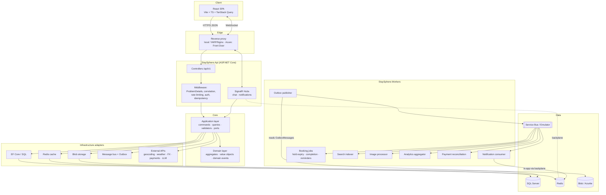
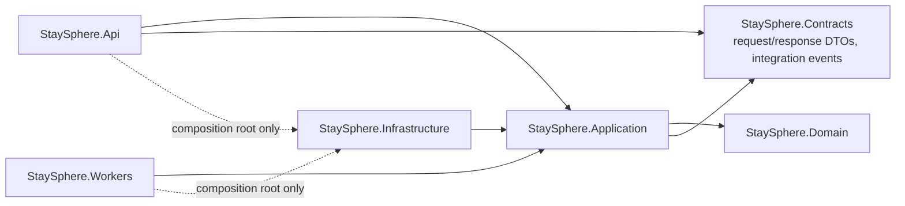

# 1–3. System Architecture, Components, Module Boundaries

## 1. Architectural style

**Modular monolith + event-driven side effects** ([ADR-001](../adr/ADR-001-modular-monolith.md)).

- One deployable API (`StaySphere.Api`) hosts all modules in-process. Synchronous calls between
  modules go only through each module's **public contract** (an interface in
  `StaySphere.Application/<Module>/Contracts`). A module never touches another module's
  DbSets or entities.
- One deployable worker host (`StaySphere.Workers`) runs the outbox publisher, Service Bus
  consumers and scheduled jobs. It uses the same Application/Infrastructure assemblies, so it
  scales independently of the API.
- Data is **one SQL Server database, one schema per module** (`identity.*`, `catalog.*`,
  `booking.*`, `payments.*` and so on). Cross-schema foreign keys are allowed only toward
  "reference" data (users, properties). Each module owns its migrations folder. Extracting a module
  later means moving its schema to a new database and replacing the in-process contract with
  HTTP or messaging.
- **SQL Server is the system of record.** Redis is a cache, rate-limit store and SignalR backplane,
  and is never authoritative.
- Side effects that cross module boundaries (notifications, analytics, search index, host
  ledger) are driven by **integration events** written to an **outbox** in the same transaction
  as the state change.

## 2. Component diagram (layers and dependency rule)

Rules, enforced by `StaySphere.ArchitectureTests` (NetArchTest):

| Rule | Why |
|------|-----|
| Domain references nothing but the BCL | Business rules stay pure and unit-testable |
| Application doesn't reference Infrastructure, EF Core, ASP.NET or Azure SDKs | Ports and adapters |
| Api uses Infrastructure only in `Program.cs` / `DependencyInjection` | Controllers can't reach DbContext |
| Module A's Application namespace doesn't use Module B's internal types | Modules stay extractable |
| Controllers inherit `ApiControllerBase`, are `sealed`, and have no DbContext dependency | Thin controllers |
| AI tool classes depend only on Application contracts | Agents can't bypass business rules |

## 3. Module boundaries

The brief listed 28 modules. Several are too small to stand alone, so they are grouped into
**12 bounded contexts**. The original names survive as sub-folders, so nothing is lost and
nothing is over-split.

| Bounded context | Includes (from brief) | Owns tables (schema) | Publishes | Consumes |
|---|---|---|---|---|
| **Identity** | Identity, Users, Profiles | `identity`: Users, Roles, UserRoles, RefreshTokens, UserProfiles, ConsentRecords | UserRegistered, EmailVerified, UserSuspended | — |
| **Hosting** | Hosts | `hosting`: Hosts, HostVerifications | HostOnboarded | UserRegistered |
| **Catalog** | Properties, Property Images, Amenities, Locations | `catalog`: Properties, PropertyImages, Amenities, PropertyAmenities, PropertyRules, PropertyPolicies, Addresses | PropertyPublished, PropertyUpdated, PropertyUnpublished, ImageUploaded | ImageProcessed |
| **Availability & Pricing** | Availability, Pricing, Taxes, Promotions, Coupons | `pricing`: AvailabilityCalendar, BlockedDates, PricingRules, SeasonalPricing, TaxRules, Promotions, Coupons, CouponRedemptions | PricingChanged, AvailabilityChanged | ReservationConfirmed/Cancelled (calendar) |
| **Search** | Search | `search`: PropertySearchIndex (denormalised), SearchQueries | — | PropertyPublished/Updated, PricingChanged, ReviewCreated |
| **Booking** | Reservations | `booking`: Reservations, ReservationNights, ReservationGuests, ReservationStatusHistory | ReservationHeld, ReservationConfirmed, ReservationCancelled, ReservationCompleted, ReservationExpired | PaymentSucceeded, PaymentFailed, RefundCompleted |
| **Payments** | Payments, Refunds | `payments`: Payments, PaymentTransactions, Refunds, WebhookEvents, LedgerEntries, HostPayouts | PaymentSucceeded, PaymentFailed, RefundCompleted | ReservationCancelled |
| **Reviews** | Reviews | `reviews`: Reviews, ReviewResponses | ReviewCreated, ReviewModerated | ReservationCompleted |
| **Engagement** | Favorites, Messaging, Notifications | `engagement`: Favorites, Conversations, ConversationParticipants, Messages, Notifications | MessageSent | almost everything (notifications) |
| **Support & Trust** | Support, Reports, Fraud/Risk | `trust`: SupportTickets, TicketMessages, Reports, FraudChecks, RiskSignals | FraudAlertRaised | PaymentFailed, ReservationCreated/Cancelled, UserRegistered |
| **Administration & Analytics** | Admin, Analytics | `analytics`: DailyPlatformStats, HostDailyStats | — | all business events |
| **Platform** (cross-cutting) | Audit, AI Assistant, feature flags, idempotency, outbox | `platform`: AuditLogs, OutboxMessages, InboxMessages, IdempotencyRecords, AiConversations | — | — |

The **AI Assistant** is a client of the other contexts (through tools), not an owner of business
data. **Audit** is cross-cutting: a `SaveChanges` interceptor plus explicit `IAuditLog` calls for
security events.

### Inter-module communication

| Need | Mechanism | Example |
|------|-----------|---------|
| Synchronous query across modules | In-process contract interface | Booking calls `IPricingQuote.QuoteAsync` |
| State change triggering work elsewhere | Integration event through outbox → Service Bus | `ReservationConfirmed` → Notifications, Analytics, Ledger |
| Change within one aggregate | Domain event, dispatched in-process before commit | `Reservation.Confirm()` raises `ReservationConfirmedDomainEvent` → mapped to outbox row |

### Consistency model

- **Strong consistency** inside a module transaction: reservation, its night rows, its status
  history and its outbox message are committed atomically.
- **Eventual consistency** across modules: search index, notifications, analytics and host ledger
  lag by seconds. Consumers are **idempotent**, using the `InboxMessages` table keyed by
  `(MessageId, Consumer)`.
- Money flows (payment → reservation confirmation) are a two-step process coordinated by
  events, with a reconciliation job as the safety net.

## Cross-cutting design choices

| Concern | Choice |
|---|---|
| IDs | Strongly typed `readonly record struct PropertyId(Guid Value)` using **UUIDv7** (`Guid.CreateVersion7()`) for index-friendly sequential keys |
| Money | `Money` value object (`decimal Amount`, `Currency Code`), stored as `decimal(19,4)` plus `char(3)`; no floats anywhere |
| Time | `TimeProvider` injected; `DateTimeOffset` UTC for instants; `DateOnly` for stay nights |
| Concurrency | `rowversion` on every aggregate root plus the unique-night constraint for bookings (see flows doc) |
| Errors | `Result<T>` for expected failures, exceptions only for bugs and infrastructure; mapped to RFC 9457 ProblemDetails |
| Validation | FluentValidation at the Application boundary; invariants in Domain |
| Versioning | URL segment `/api/v1` via `Asp.Versioning.Mvc` |
| Feature flags | `Microsoft.FeatureManagement` (local JSON → Azure App Configuration in prod) |
| Observability | OpenTelemetry (traces, metrics, logs) → OTLP → Aspire Dashboard locally, Azure Monitor in prod; Serilog for structured console logs |
| Resilience | `Microsoft.Extensions.Http.Resilience` (Polly v8) standard pipeline on every outbound `HttpClient`; **no retries on payment capture** |

## Failure-mode summary

| Dependency down | Behaviour |
|---|---|
| SQL Server | `/health/ready` fails, so traffic stops routing. Writes return 503 ProblemDetails. |
| Redis | Cache bypassed (fail-open with a short circuit breaker). Rate limiting falls back to in-process limiter. SignalR runs on a single instance. |
| Service Bus | Outbox rows accumulate and are published on recovery. No user-facing impact. |
| Blob storage | Image upload returns 503. Existing images are served from CDN cache. |
| Payment provider | Reservation stays `PaymentPending` until the hold expires. Users see a retry message. |
| Email | Notification consumer retries, then dead-letters. In-app notification still delivered. |
| Maps/geocoding | Map hidden. Search by text and filters still works. Cached geocodes are used. |
| Weather / FX | Widget hidden / last cached rate shown with timestamp. |
| LLM | Assistant shows "unavailable". The rest of the site is unaffected (feature flag). |
