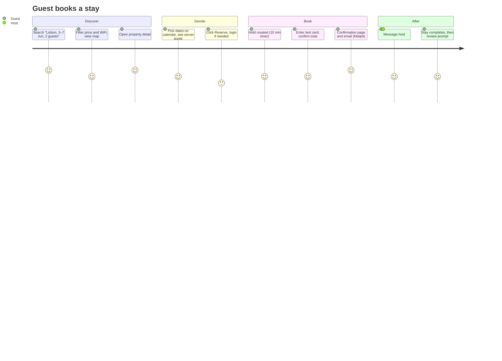

# 6–7. Frontend Page Inventory & User Journeys

## Frontend architecture

- React 19 + TypeScript (strict), built with Vite. Routing uses React Router (data routers with
  lazy routes). Server state uses TanStack Query, and client UI state uses Zustand.
- Forms use React Hook Form + Zod. The Zod schemas are generated from OpenAPI where possible.
- Styling uses Tailwind CSS plus Radix UI primitives (shadcn/ui-style, owned components).
  Leaflet/React-Leaflet renders OSM tiles, Recharts draws charts, and `@microsoft/signalr`
  handles real time.
- The API client is **generated from `openapi/v1.json`** with `openapi-typescript` and
  `openapi-fetch`. Contract drift fails CI ([07-testing-strategy.md](07-testing-strategy.md)).
- Auth keeps the access token **in memory** only. A silent refresh on load calls
  `/auth/refresh` with the HttpOnly cookie. A single-flight refresh runs on 401. The UI hides
  actions by role, but the backend is the enforcement point.
- Branding: name "StaySphere", an original logo, teal/coral palette, and the Inter font. No
  Airbnb assets, iconography or copy.

```
web/staysphere-web/src/
  app/            router, providers, layouts, error boundary
  features/
    auth/ search/ properties/ reservations/ payments/ reviews/
    favorites/ messaging/ notifications/ host/ admin/ support/ ai/
      api.ts  hooks.ts  components/  pages/  schemas.ts
  components/     PropertyCard SearchBar DateRangePicker GuestSelector PriceBreakdown
                  ImageGallery Rating ReviewCard Map Navbar Footer Modal Toast
                  Skeleton Pagination DataTable EmptyState ErrorState
  api/            generated client + query keys
  hooks/ lib/ types/ utils/
```

## Page inventory

| Route | Page | Access | Key components / data |
|---|---|---|---|
| `/` | Home: hero "Find your next stay", search, curated rails | Public | SearchBar, PropertyCard rails (`/destinations/featured`, search presets) |
| `/search` | Results with filters, list and map split | Public | FilterDrawer, PropertyCard grid, Map with markers, Pagination; URL-synced filters |
| `/property/:id` | Property detail | Public | ImageGallery, host card, amenities, rules, policy, AvailabilityCalendar, BookingWidget (server quote), ReviewList, Map, Weather, Similar; SEO meta and JSON-LD |
| `/book/:reservationId` | Checkout: hold countdown, price breakdown, fake card form, confirm | Guest | PriceBreakdown, HoldTimer, PaymentForm |
| `/login` `/register` `/forgot-password` `/reset-password` `/verify-email` | Auth | Public | RHF + Zod forms |
| `/profile` | Profile, password, data export, delete account | User | |
| `/favorites` | Saved stays | User | Empty state: "You haven't saved any stays yet." |
| `/trips`, `/trips/:id` | Upcoming and past stays, cancel (with preview), review | Guest | Empty state: "Your upcoming stays will appear here." |
| `/messages`, `/messages/:conversationId` | Inbox and real-time chat | User | typing, read receipts, presence |
| `/notifications` | Notification center | User | live via hub |
| `/become-a-host` | Host onboarding | User | |
| `/host` | Host dashboard (KPIs and charts) | Host | Recharts |
| `/host/properties`, `/host/properties/new`, `/host/properties/:id/edit` | Listings and **12-step wizard** with autosave drafts | Host | Empty state: "Create your first listing." |
| `/host/calendar` | Multi-property calendar, block dates, seasonal prices | Host | |
| `/host/reservations` `/host/earnings` `/host/reviews` `/host/analytics` | Host ops | Host | DataTable, ledger view |
| `/admin` + `/admin/users` `/properties` `/reservations` `/payments` `/reviews` `/reports` `/audit` | Admin console | Admin | DataTable with server paging |
| `/support` (+ `/support/tickets/:id`) | Tickets (user) and queue (agent) | User / Support | |
| `*` | 404 | Public | |

There is a global **AI assistant launcher** (floating button behind the `AiAssistant` flag).
Error pages and toasts cover 401/403/404/409/422/429/500, network errors and timeouts, using
ProblemDetails `title`/`detail`.

## User journeys

### J1 — Guest finds and books a stay


### J2 — User becomes a host and publishes
Register → `/become-a-host` → wizard (type → location with geocode and map pin → basics →
rooms → amenities → photos uploaded to blob, thumbnails processed async → description → rules →
pricing → availability → preview → publish). Each step **autosaves** the draft through
`PATCH /properties/{id}`. On publish the server validates completeness, emits
`PropertyPublished`, and the search indexer makes the listing searchable within seconds.

### J3 — Host manages bookings
Real-time "New booking" notification → `/host/reservations` → message guest → block dates in the
calendar → see revenue in `/host/earnings` (from the immutable ledger) → respond to review.

### J4 — Guest cancels
`/trips/:id` → **Cancel** → preview shows the refund per policy (Flexible/Moderate/Strict,
computed server-side) → confirm → reservation `RefundPending` → refund processed →
`Refunded`, with ledger compensating entries and an email.

### J5 — Support resolves a dispute
Guest opens ticket linked to reservation → agent picks from queue → views reservation and
payments (read-only) → messages guest → escalates refund to admin → resolves.

### J6 — Admin moderation
Fraud alert (for example, five failed payments in ten minutes) appears on the dashboard → admin
reviews risk signals → suspends user (audited) → user's active sessions are revoked by refresh
token family.

### J7 — AI-assisted booking
"Find a family-friendly place in Goa for 4 under ₹8,000/night, 12–16 Dec" → assistant calls
`SearchProperties` + `CheckAvailability` + `CalculatePrice` → shows three cards with reasons →
"Book the second one" → assistant shows the final price and asks for **explicit confirmation**
(a UI button, not free text) → creates hold → hands off to `/book/:reservationId` for payment.
The assistant never takes payment itself.
