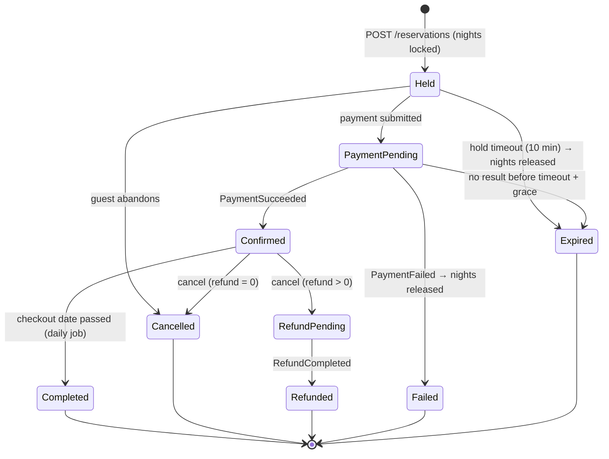
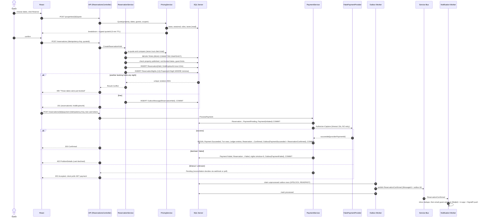
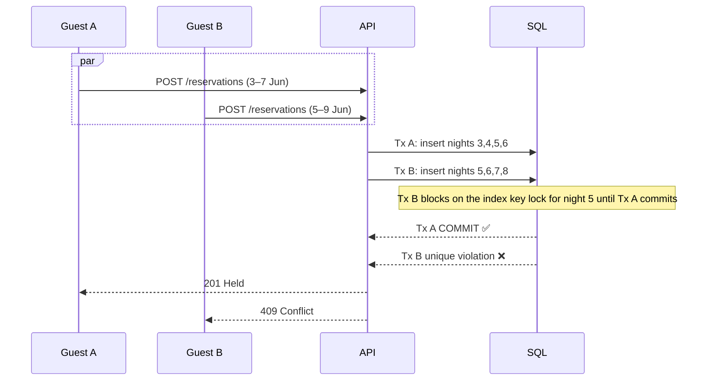
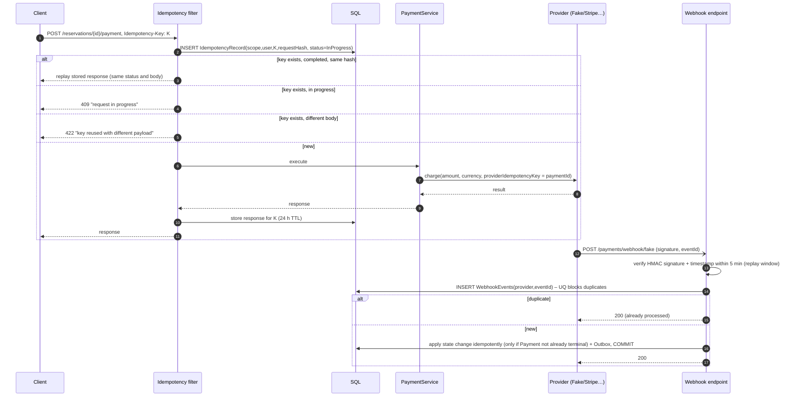
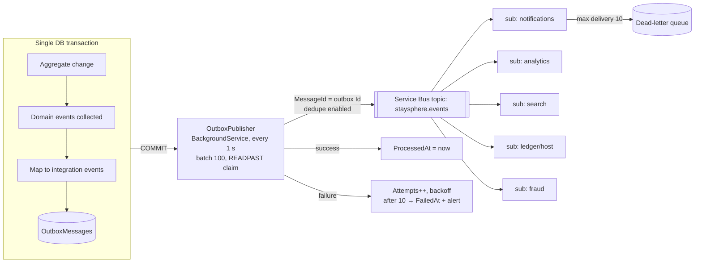

# 8–10. Booking & Payment Flows, Outbox, Service Bus Event Map

## Reservation state machine

The brief's `Pending` state is represented by `Held`, because there is no reservation before the
hold. `Expired` is added as a terminal state, distinct from `Failed`, so analytics can tell them
apart. Transitions are methods on the `Reservation` aggregate (`Hold`, `MarkPaymentPending`,
`Confirm`, `Cancel(policy, now)`, `Complete`, `Expire`), and illegal transitions return a
domain error.

## 8. Booking sequence (hold → pay → confirm)

### Concurrency: two guests, the same nights

This is verified by an integration test that fires N parallel requests against a real SQL
Server (Testcontainers) and asserts exactly one success.

### Hold expiry
`HoldExpiryJob` runs in Workers every 30 seconds. It claims expired holds with
`UPDATE TOP (100) ... OUTPUT ... WITH (READPAST)` on `Status IN ('Held','PaymentPending')
AND HoldExpiresAt < now - grace`. For each one it calls `Reservation.Expire()`, deactivates the
nights and writes an outbox `ReservationExpired`. This is safe with many worker replicas because
of `READPAST` row claiming, so no distributed lock is needed. For `PaymentPending` it **first asks
the provider** for status, so a late success can't be lost.

## 9. Payment sequence: idempotency and webhooks

`LocalFakePaymentProvider` picks its scenario from the test card number:

| Card | Outcome |
|---|---|
| 4242 4242 4242 4242 | success |
| 4000 0000 0000 0002 | declined |
| 4000 0000 0000 9995 | insufficient funds |
| 4000 0000 0000 0119 | timeout (no response, webhook arrives 15 s later) |
| 4000 0000 0000 0259 | success + duplicate webhook delivered twice |

The provider also exposes `POST /fake-provider/refunds` and emits signed webhooks to the API.
The server only ever sees a token like `tok_4242`, never a PAN. Real PANs are rejected by
format in non-dev builds.

### Refund and ledger
Cancelling calls `ICancellationPolicyService.Calculate(policy, reservation, now)`, which
returns a refund amount. Then: `Refund(Requested)` → provider → `RefundCompleted`.
The ledger adds compensating entries (`Refund` debit to platform, reversal of `HostEarning`
proportional to the refund). Rows are never updated or deleted.

| Ledger entry on confirmation (example, total 500.00) | Debit | Credit |
|---|---|---|
| GuestPayment | 500.00 | |
| PlatformFee (service fee + 3% host fee) | | 62.00 |
| Taxes payable | | 38.00 |
| HostEarning | | 400.00 |

## Outbox pattern

- The outbox rows are written by an EF Core `SaveChangesInterceptor`, so a handler can't
  "forget". **Nothing is published before commit.**
- Delivery is at-least-once. Service Bus duplicate detection (on `MessageId`) plus consumer
  `InboxMessages` gives effectively-once processing.
- Ordering per reservation uses `SessionId = ReservationId` on subscriptions that need it.
- The DLQ is surfaced on the admin dashboard, and `staysphere ops replay-dlq` re-submits after a fix.

## 10. Service Bus event map

One topic, `staysphere.events`, with SQL-filter subscriptions per consumer on the `EventType`
property. Commands that need a single consumer (image processing, emails) use dedicated
**queues**.

| Integration event | Producer | Notification | Analytics | Search idx | Ledger/Host | Fraud | Other |
|---|---|---|---|---|---|---|---|
| UserRegistered | Identity | ✅ verify email | ✅ | | | ✅ multi-account check | Hosting |
| EmailVerified | Identity | ✅ welcome | ✅ | | | | |
| PropertyPublished / Updated / Unpublished | Catalog | ✅ host | ✅ | ✅ | | | cache invalidation |
| ImageUploaded → queue `image-processing` | Catalog | | | | | | ImageWorker produces ImageProcessed |
| PricingChanged / AvailabilityChanged | Pricing | | | ✅ | | | cache invalidation |
| ReservationHeld | Booking | | ✅ funnel | | | ✅ velocity | |
| ReservationConfirmed | Booking | ✅ guest + host | ✅ | ✅ (occupancy) | ✅ | | conversation auto-created |
| ReservationCancelled | Booking | ✅ | ✅ | ✅ | ✅ | ✅ rapid-cancel | Payments → refund |
| ReservationExpired | Booking | ✅ "hold expired" | ✅ | | | | |
| ReservationCompleted | Booking | ✅ review reminder | ✅ | | ✅ payout eligible | | Reviews enabled |
| PaymentSucceeded | Payments | ✅ receipt | ✅ | | | | Booking confirms |
| PaymentFailed | Payments | ✅ | ✅ | | | ✅ repeated failures | Booking fails |
| RefundCompleted | Payments | ✅ | ✅ | | ✅ | | Booking → Refunded |
| ReviewCreated | Reviews | ✅ host | ✅ | ✅ rating | | ✅ spam heuristics | |
| MessageSent | Engagement | ✅ email if offline >5 min | | | | | |
| FraudAlertRaised | Trust | ✅ admins | ✅ | | | | |
| UserSuspended | Identity | ✅ | ✅ | ✅ hide listings | | | sessions revoked |

Scheduled jobs (Workers, using a cron-style `PeriodicTimer` plus row claiming; Container Apps
Jobs in Azure): hold expiry (30 s), reservation completion (hourly), check-in reminder (daily,
48 h before), review reminder (daily), payment reconciliation (5 min), analytics roll-up
(hourly/nightly), idempotency and outbox cleanup (daily).

## Caching (cache-aside)

| Key | TTL | Invalidated by |
|---|---|---|
| `property:{id}:v{rowversion}` detail DTO | 10 min | PropertyUpdated/Published, PricingChanged |
| `search:{hash(normalised query)}` | 60 s | short TTL only (no fan-out invalidation) |
| `geocode:{normalised q}` | 30 days | — |
| `weather:{lat2dp}:{lng2dp}` | 30 min | — |
| `fx:{base}` | 6 h | — |
| `availability:{propertyId}:{month}` | 2 min | AvailabilityChanged, ReservationConfirmed/Cancelled/Expired |

The quote and reservation write path **never reads from cache**.
