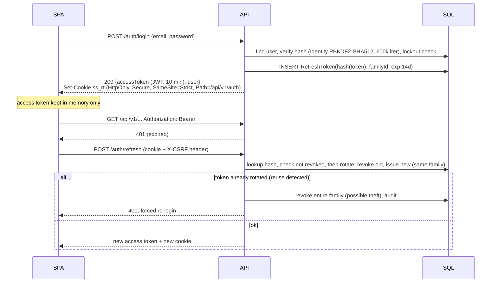

# 14. Security Architecture & Threat Model

## Authentication flow

- JWTs are signed with an **asymmetric key** (ES256) from Key Vault, with `kid` rotation. They
  are validated for issuer, audience, lifetime and a 30-second clock skew. Claims are `sub`,
  `role`, `sstamp` (security stamp, checked for sensitive operations so suspension takes effect).
- Email verification and password reset use single-use, hashed, time-limited tokens.
  Forgot-password always returns 202, so there is no account enumeration.
- Lockout is 5 failures, then 15 minutes. It is per-account plus per-IP throttling.

## Authorization

Policy-based with resource handlers:

| Policy | Requirement |
|---|---|
| CanCreateProperty | role Host, user not suspended |
| CanManageProperty | **resource**: `property.HostId == currentHost` OR Admin |
| CanViewReservation | **resource**: guest OR property's host OR Support OR Admin |
| CanManageReservation | **resource**: guest (cancel) / host (accept/decline) / Admin |
| CanProcessRefund | Admin (Support can *request*) |
| CanModerateReview, CanModerateProperty, CanManageUsers, CanViewAdminDashboard, CanViewAudit, CanManagePromotions | Admin (some granted to Support read-only) |

IDOR defence: every query for a user-owned resource includes the ownership predicate *in the
query*, for example `WHERE GuestId = @me`. A missing resource and someone else's resource both
return **404**, so existence isn't leaked. Admin endpoints return 403. API tests cover every
policy with a cross-tenant case.

## Controls checklist
| Area | Control |
|---|---|
| Transport | HTTPS only, HSTS (prod), TLS at Front Door |
| Headers | CSP (`default-src 'self'`; tiles and images from allow-listed hosts), `X-Content-Type-Options`, `Referrer-Policy`, `Permissions-Policy`, `frame-ancestors 'none'` |
| CORS | explicit SPA origins per environment, credentials only for `/auth/*` |
| CSRF | Bearer tokens aren't sent automatically. The refresh cookie is `SameSite=Strict`, path-scoped, and needs a custom header. |
| XSS | React escaping; no `dangerouslySetInnerHTML`; user-generated text is stored raw and rendered as text; Markdown is not supported in messages |
| SQLi | EF Core parameterisation; raw SQL only through `FromSql` interpolated (parameterised); analyzer bans `FromSqlRaw` with concatenation |
| Uploads | allow-list JPEG/PNG/WebP by **magic bytes**, 10 MB maximum, at most 40 megapixels, re-encode (strips EXIF/GPS), quarantine container, `IMalwareScanner` (Defender in Azure, no-op/ClamAV locally), random blob names |
| Rate limiting | ASP.NET Core rate limiter: `anon` 100/min/IP, `user` 300/min/user, `auth-strict` 5/min/IP + per account, `payment` 10/min/user, `ai` 20/min + daily token budget, `messaging` 30/min, `upload` 20/min. Distributed through Redis in production. 429 responses carry `Retry-After`. |
| Secrets | none in git (gitleaks in CI); User Secrets/.env locally; Key Vault + Managed Identity in Azure |
| Logging | Serilog destructuring policies redact `password`, `token`, `authorization`, `cardNumber`, email (hashed). Query strings for hubs are dropped. |
| Payments | no PAN storage; tokens only; webhook HMAC + timestamp; idempotency |
| Audit | login/logout/failed login, property create/update/publish, reservation lifecycle, payments/refunds, admin actions, suspensions, data export/delete. Records actor, IP, user agent hash and correlation ID. Insert-only. |
| Privacy | `/me/export` (JSON bundle), account deletion anonymises PII (reviews and messages kept as "Former user"), consent records, data minimisation in DTOs (host never sees guest email/phone) |
| Supply chain | Dependabot, `dotnet list package --vulnerable`, `npm audit`, CodeQL, Trivy image scan, SBOM (CycloneDX), pinned base image digests |

## Threat model (STRIDE summary)

| Threat | Impact | Mitigation |
|---|---|---|
| Credential stuffing / brute force | Account takeover | strict rate limits, lockout, breached-password check (k-anon HIBP behind a flag), generic errors |
| JWT theft | Session hijack | 10-minute access tokens in memory only; refresh in HttpOnly cookie; rotation with reuse detection; security stamp revocation |
| CSRF | Unwanted actions | bearer auth for APIs; SameSite=Strict + custom header on the refresh endpoint |
| XSS | Token or data theft | CSP, React escaping, sanitised rendering, no tokens in storage |
| SQL injection | Data breach | EF parameterisation, analyzers, least-privilege DB user (no DDL at runtime) |
| Broken access control / IDOR | Data leak, tampering | resource-based policies, ownership predicates, 404-on-foreign, exhaustive authz tests |
| Price tampering | Revenue loss | server-side quote, HMAC-signed `quoteId`, re-quote at hold, totals never accepted from the client |
| Payment replay / double charge | Financial loss | Idempotency-Key records, provider idempotency key, unique `ProviderPaymentId` |
| Webhook spoofing / replay | Fake confirmations | HMAC signature, 5-minute timestamp window, unique `(provider, eventId)`, state-machine guards |
| Double booking race | Customer harm | unique filtered index on nights + transaction; concurrency test |
| Prompt injection (in listings, reviews or user text) | Agent misuse | tools enforce authz with the *user's* identity; untrusted content delimited and never treated as instructions; financial and destructive tools need UI confirmation; output schema validation; see the AI doc |
| Rate abuse / scraping | Cost, DoS | rate limits, Front Door WAF bot rules, pagination caps, search result caps |
| Malicious image upload | RCE, XSS, malware | magic-byte check, re-encode, quarantine + scan, served from separate domain/CDN with `Content-Disposition` and correct content type |
| DoS | Outage | WAF, rate limiting, request size limits, timeouts, autoscale, bulkheads on outbound calls |
| Insider misuse (admin) | Data abuse | audited admin actions, least privilege, Entra SSO + MFA for staff |
| PII leakage in logs | Compliance | redaction policy, log reviews in tests (assert no `password` in captured logs) |
