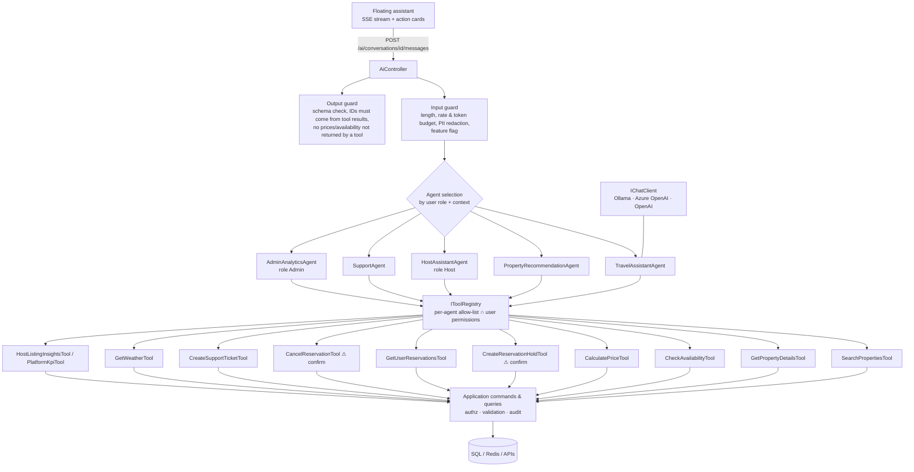

# 15. AI Agent Architecture

See [ADR-007](../adr/ADR-007-agent-architecture.md).

## Principles
1. **Agents are clients of the Application layer, not of the database.** Every tool is a thin
   adapter over an existing command or query, and it goes through the same validation,
   authorization, idempotency and audit pipeline as an HTTP request.
2. **The model proposes; the system disposes.** Tools enforce business rules. The model can't
   create availability, prices or bookings that the services would reject.
3. **Financial and destructive actions require out-of-band human confirmation.** The tool
   returns a *pending action*, the SPA renders a confirm button, and only
   `POST /ai/.../confirmations/{actionId}` executes it. Typing "yes" isn't enough.
4. **Provider-agnostic.** `Microsoft.Extensions.AI.IChatClient` sits under Microsoft Agent
   Framework. Ollama is used locally, and Azure OpenAI/OpenAI are a configuration change. The
   model name always comes from configuration.



## Agents

| Agent | Who | Tools | Notes |
|---|---|---|---|
| TravelAssistantAgent | any user | search, details, availability, price, weather, reservation hold ⚠, my reservations | orchestrates; can delegate to PropertyRecommendationAgent |
| PropertyRecommendationAgent | internal | search, details, reviews summary | ranks and explains ("why recommended"), compares properties |
| HostAssistantAgent | Host | own listings insights, pricing suggestions (read-only), draft description | never changes price without confirmation |
| SupportAgent | any user | my reservations, cancel preview, create ticket, cancel ⚠ | escalates to a human ticket when unsure |
| AdminAnalyticsAgent | Admin | platform KPI queries (pre-defined, parameterised) | no free-form SQL, ever |

## Tool contract
```csharp
public interface IAgentTool
{
    string Name { get; }
    string Description { get; }
    JsonElement ParametersSchema { get; }          // generated from a record type
    ToolRisk Risk { get; }                          // Read | Write | Financial
    IReadOnlySet<string> RequiredPermissions { get; }
    Task<ToolResult> InvokeAsync(JsonElement args, AgentContext ctx, CancellationToken ct);
}
// AgentContext carries the *authenticated user's* ClaimsPrincipal; tools never run as a system identity.
```
- Arguments are deserialised into records and validated with FluentValidation before any call.
- `Financial`/`Write` tools in confirm-mode return `PendingAction{id, summary, price breakdown, expiresAt}`
  stored server-side. Approval replays the *stored* arguments, so the model can't swap them.
- Every invocation is logged to `AiConversations` and the audit log: tool, args (redacted),
  result status, latency and tokens.

## AI booking flow ("Book this property")
1. Resolve the property ID from earlier tool results in the conversation, never from model memory.
2. Ask for missing dates or guests.
3. `CheckAvailability`.
4. `CalculatePrice`, which returns the server quote.
5. Show the breakdown.
6. `CreateReservationHold` → PendingAction → the user clicks **Confirm**.
7. The hold is created with the same idempotency semantics.
8. The assistant returns a link to `/book/{reservationId}`. **Payment is only done in the
   checkout UI.** No AI tool can pay.

## Safety controls
| Risk | Control |
|---|---|
| Prompt injection via listing or review text | tool outputs wrapped as data (`<tool_result>` JSON), system prompt states that tool content is untrusted, tools ignore any "instructions", no tool can escalate privileges |
| Hallucinated availability or prices | output guard rejects responses citing property IDs or prices not present in this turn's tool results; UI renders prices from structured tool data, not model text |
| PII | redact emails, phones and cards from user input before sending to an external LLM; tools return minimal DTOs |
| Abuse / cost | per-user rate limit, daily token budget, 20 turns per conversation, 8 tool calls per turn, max output tokens |
| Silent actions | confirmation gate for Write/Financial; cancellation is also gated |
| Provider outage | `IChatClient` wrapped with timeout and circuit breaker; graceful "assistant unavailable"; feature flag kill-switch |

## Configuration
```json
"AI": {
  "Provider": "Gemini",   // Gemini (default) | FoundryLocal | Ollama | OpenAI | Rules
  "Model": "",            // empty = gemini-flash-latest for Gemini; required for the others
  "BaseUrl": "",          // required for FoundryLocal (dynamic port), optional otherwise
  "ApiKey": "",           // never in source control: user secrets, .env, or Key Vault ("ai-api-key")
  "MaxTurns": 20,
  "TimeoutSeconds": 60
}
```
Env vars `AI__Provider`, `AI__Model`, `AI__BaseUrl`, `AI__ApiKey` (`AI_PROVIDER` etc. in `.env`);
Gemini also reads `GEMINI_API_KEY` / `GOOGLE_API_KEY`.

How each provider is wired (`src/StaySphere.Infrastructure/Ai/AiChatClients.cs`). Everything above the
`IChatClient` (agent, tools, confirmation gate, PII redaction) is identical for every provider.

| Provider | Client |
|---|---|
| Gemini | Official Google Gen AI SDK (`Google.GenAI`), which implements `IChatClient` natively |
| FoundryLocal, OpenAI | `OpenAI` SDK + `Microsoft.Extensions.AI.OpenAI` against any OpenAI-compatible `/v1` endpoint |
| Ollama | `OllamaSharp` |

`AiProviderSettings.Resolve` decides the effective provider at startup. If an LLM provider lacks what it needs
(e.g. no Gemini key), the API logs a warning that says how to fix it, and the rule-based engine answers. At runtime
any provider error (bad key, quota, timeout) also falls back to the rule engine for that message.

Semantic Kernel was not needed: Agent Framework is its successor for agents and runs on the same
`Microsoft.Extensions.AI` abstractions, which Google's SDK implements directly. Tool-calling quality depends on
the model; small local models (Foundry Local, Ollama) may skip tools or call them incorrectly.

## Evaluation
`StaySphere.UnitTests/Ai` uses a `ScriptedChatClient` to test tool routing, the confirmation gate,
the authorization denial path and the output guard deterministically. An optional
`ai-eval` CI job (manual trigger) runs a fixed prompt set against a real model and records
pass rates.
