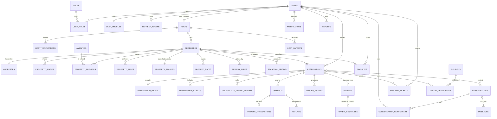

# 4. Database ER Model

SQL Server (Azure SQL in production). There is one database, with **one schema per bounded
context**. All primary keys are UUIDv7 `uniqueidentifier`. Every aggregate root has
`CreatedAt`, `UpdatedAt` (`datetimeoffset(3)`) and `RowVersion` (`rowversion`). Soft delete
(`DeletedAt`) is used only where the brief requires retention, such as users and properties.
Financial tables are **insert-only**.

## ER diagram — core

## Key tables (abridged columns)

### identity
| Table | Key columns | Constraints / indexes |
|---|---|---|
| Users | Id, Email, NormalizedEmail, PasswordHash, EmailConfirmed, LockoutEnd, AccessFailedCount, Status, SecurityStamp | UQ(NormalizedEmail) |
| Roles / UserRoles | Guest, Host, Admin, SupportAgent | PK(UserId, RoleId) |
| RefreshTokens | Id, UserId, TokenHash (SHA-256), FamilyId, ExpiresAt, RevokedAt, ReplacedById, CreatedByIp | UQ(TokenHash); IX(UserId, FamilyId) |
| UserProfiles | UserId (PK/FK), DisplayName, AvatarBlobKey, Bio, PreferredCurrency, Locale | — |
| ConsentRecords | UserId, Purpose, GrantedAt, WithdrawnAt | insert-only |

### catalog
| Table | Key columns | Constraints / indexes |
|---|---|---|
| Properties | Id, HostId, Title, Description, PropertyType, RoomType, MaxGuests, Bedrooms, Beds, Bathrooms (decimal(3,1)), BasePrice, CleaningFee, Currency, AddressId, Location (`geography` point) + Latitude/Longitude, InstantBook, Status (Draft/Published/Unlisted/Suspended), CancellationPolicy, RatingAvg, ReviewCount | CK(MaxGuests BETWEEN 1 AND 50), CK(BasePrice > 0); IX(Status, CityId) INCLUDE(...); spatial index on Location |
| Addresses | Id, Line1, Line2, City, Region, PostalCode, CountryCode | IX(CountryCode, City) |
| PropertyImages | Id, PropertyId, BlobKey, ThumbBlobKey, Width, Height, SortOrder, Status (Pending/Ready/Rejected) | UQ(PropertyId, SortOrder) |
| Amenities / PropertyAmenities | Code (wifi, pool, parking…), Category | PK(PropertyId, AmenityId) |

### pricing
| Table | Key columns | Notes |
|---|---|---|
| BlockedDates | PropertyId, Date, Reason (HostBlock/Maintenance) | PK(PropertyId, Date) |
| PricingRules | PropertyId, Kind (Weekend/LengthOfStay/LastMinute), Adjustment (percent or amount), Params JSON | |
| SeasonalPricing | PropertyId, StartDate, EndDate, NightlyPrice | CK(EndDate > StartDate) |
| TaxRules | CountryCode, Region, Rate, Kind (Occupancy/VAT) | |
| Coupons / CouponRedemptions | Code, DiscountKind, Value, MaxRedemptions, ValidFrom/To | UQ(Code); UQ(CouponId, UserId) |

### booking — the double-booking guard
| Table | Key columns | Constraints / indexes |
|---|---|---|
| Reservations | Id, PropertyId, GuestId, CheckIn (date), CheckOut (date), Guests, BaseAmount, CleaningFee, ServiceFee, Taxes, Discount, TotalAmount, Currency, Status, HoldExpiresAt, QuoteHash, IdempotencyKey | CK(CheckOut > CheckIn); CK(Guests >= 1); IX(GuestId, CheckIn); IX(Status, HoldExpiresAt) filtered `WHERE Status='Held'`; UQ(GuestId, IdempotencyKey) |
| **ReservationNights** | ReservationId, PropertyId, Night (date), IsActive (bit) | **Filtered unique index `UQ(PropertyId, Night) WHERE IsActive = 1`** |
| ReservationStatusHistory | ReservationId, From, To, At, ActorId, Reason | insert-only |
| ReservationGuests | ReservationId, Adults, Children, Infants, Pets | |

A stay is materialised as one row per night. Two concurrent bookings that overlap by even
one night cannot both commit, because the second hits the unique index and receives a
`2601/2627` error, which we map to `409 Conflict`. This relies on a database constraint, so it
holds across any number of API instances without distributed locks. Cancelling, expiring or
failing a reservation sets `IsActive = 0` on its nights (keeping history) in the same
transaction as the status change. See [ADR-002](../adr/ADR-002-sql-server.md).

### payments (insert-only ledger)
| Table | Key columns | Notes |
|---|---|---|
| Payments | Id, ReservationId, Amount, Currency, Status, Provider, ProviderPaymentId, IdempotencyKey | UQ(Provider, ProviderPaymentId); UQ(IdempotencyKey) |
| PaymentTransactions | PaymentId, Kind (Authorize/Capture/Fail/Void), Amount, ProviderRef, RawResponseHash | insert-only |
| Refunds | Id, PaymentId, Amount, Reason, Status, ProviderRefundId | CK(Amount > 0) |
| WebhookEvents | Provider, EventId, Type, ReceivedAt, ProcessedAt, PayloadHash | **UQ(Provider, EventId)**, used for replay protection |
| LedgerEntries | Id, ReservationId, HostId, Account (GuestPayment/PlatformFee/HostEarning/Refund/Adjustment/Payout), Debit, Credit, Currency, OccurredAt, CorrelationId | insert-only; DENY UPDATE/DELETE to app role |
| HostPayouts | HostId, PeriodStart, PeriodEnd, Amount, Status | |

### reviews / engagement / trust / platform
| Table | Notable constraints |
|---|---|
| Reviews | **UQ(ReservationId)** (one review per stay); six sub-ratings CK(BETWEEN 1 AND 5); Status (Published/Hidden/PendingModeration) |
| ReviewResponses | UQ(ReviewId) |
| Favorites | PK(UserId, PropertyId) |
| Conversations / Participants / Messages | Messages IX(ConversationId, SentAt DESC); Participants.LastReadMessageId for read receipts |
| Notifications | IX(UserId, IsRead, CreatedAt DESC) |
| SupportTickets | Status (Open/InProgress/WaitingForUser/Resolved/Closed), Priority, Category, AssigneeId |
| Reports | TargetType, TargetId, Reason, Status |
| FraudChecks / RiskSignals | RuleCode, Score, Subject (User/Reservation/Payment), Decision (Allow/Review/Block) |
| AuditLogs | ActorId, Action, EntityType, EntityId, Changes (JSON, PII-scrubbed), Ip, CorrelationId, At. Insert-only. |
| OutboxMessages | Id, Type, Payload (JSON), OccurredAt, ProcessedAt, Attempts, LastError, LockedUntil. IX filtered `WHERE ProcessedAt IS NULL`. |
| InboxMessages | PK(MessageId, Consumer), used for idempotent consumers |
| IdempotencyRecords | PK(Scope, UserId, Key), RequestHash, ResponseStatus, ResponseBody, ExpiresAt |
| SearchQueries | anonymised query analytics |

## Migrations and seeding
- EF Core migrations live in `StaySphere.Infrastructure/Persistence/Migrations`. All entities
  are configured through `IEntityTypeConfiguration<T>`.
- **Production**: CI produces an **idempotent SQL script** (`dotnet ef migrations script --idempotent`)
  and a migration bundle as build artifacts. They are applied by a gated pipeline step before the
  app rolls out. The app never migrates on startup outside Development. Migrations follow the
  expand/contract approach, so they stay backward compatible with the previous app version.
- **Seeding**: the `StaySphere.Seeder` console uses a fixed-seed Bogus generator to create
  120 properties, 25 hosts, 150 users, reservations and reviews. It is idempotent and runs only
  in Development/Test. Demo accounts: `guest@example.local`, `host@example.local`,
  `admin@example.local`, `support@example.local` with password `Passw0rd!Demo`, valid in dev only.
