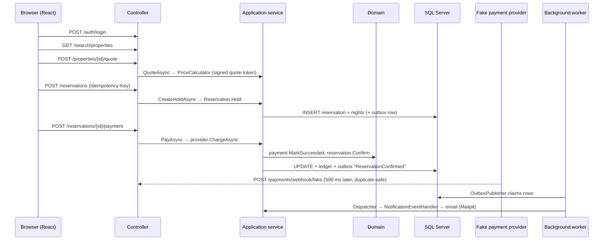

# Debugging StaySphere end to end on your machine

This guide shows how to run StaySphere under a debugger and follow one booking with breakpoints. It starts at the first click in the browser and ends at the confirmation email. It also covers the host's accept and decline actions, payouts, and background jobs.

> Line numbers were correct when this was written. If one has moved, search for the method name shown next to it.

---

## 1. The architecture in simple terms

Think of StaySphere as a restaurant.

| Restaurant | StaySphere | Where |
|---|---|---|
| Dining room and menu | **React web app**. It shows pages and sends requests | `web/staysphere-web/src` |
| Waiter | **Controllers**. They take the order, check it's complete, and pass it on. They do no cooking | `src/StaySphere.Api/Controllers` |
| Chef | **Application services**. One method per action ("create a hold", "pay", "accept request") | `src/StaySphere.Application` |
| Recipe rules | **Domain**. Pure business rules: price calculation, "can this booking be confirmed?", cancellation policies. No database, no web | `src/StaySphere.Domain` |
| Pantry and suppliers | **Infrastructure**. SQL Server, Redis, blob storage, email, payment provider, external APIs | `src/StaySphere.Infrastructure` |
| Order slips pinned for the next shift | **Outbox**. Saved in the same database transaction as the change and processed afterwards | `platform.OutboxMessages` table |
| Kitchen staff working through slips | **Background workers**. They send emails, process refunds, expire holds and pay hosts | `Messaging.cs`, `ScheduledJobs.cs` |

The one rule that ties it together is that **dependencies only point inwards**:

```
Web app ──HTTP──▶ Api ──▶ Application ──▶ Domain
                    │           ▲
                    └──▶ Infrastructure (implements the Application's interfaces)
```

The Domain knows nothing about databases or HTTP, which makes the rules easy to test. Automated tests (`tests/StaySphere.ArchitectureTests`) fail the build if this rule is broken.

What happens when you book (the short version):

1. You pick dates. The server calculates the price and returns a **signed quote**, so the browser can't change the price.
2. You click Reserve. The server creates a **10-minute hold**. It writes one row per night, and a database unique index makes double-booking impossible, even with many servers.
3. You pay. The fake payment provider charges the card. The booking becomes **Confirmed** and a **ledger** (an accounting log that is never edited, only added to) records the money.
4. The same transaction writes an **event** ("ReservationConfirmed") to the outbox. A background worker picks it up and sends emails and notifications.
5. On a request-to-book listing, step 3 only *authorizes* the card. The host then accepts (the card is charged) or declines (the hold is released).
6. 24 hours after check-in, the host's earnings become available and the **payout job** sends them to the host's bank account.

In development, everything runs inside **one process** (the API), including the background workers and jobs. That means one debugger session can hit breakpoints in any of it.

---

## 2. One-time setup

| Tool | Version | Notes |
|---|---|---|
| .NET SDK | 10.x (see `global.json`) | `dotnet --version` |
| Node.js | 24.x | `node --version` |
| Docker Desktop | any recent | Runs SQL Server and the other dependencies |
| IDE | **VS Code** with *C# Dev Kit*, **Visual Studio 2022 17.14+/2026**, or **JetBrains Rider** | All three work. VS Code configs are included |

```bash
cd StaySphere
dotnet tool restore
cd web/staysphere-web && npm ci && cd ../..
```

---

## 3. Start the dependencies (in Docker)

Only the infrastructure runs in Docker. The API and the web app run from your IDE so you can debug them.

```bash
cd StaySphere
docker compose up -d sqlserver redis azurite mailpit aspire-dashboard
```

| Service | URL / port | Use it to… |
|---|---|---|
| SQL Server | `localhost,1433`. User `sa`, password `StaySphere_Dev_P@ssw0rd` | Inspect tables while paused at a breakpoint |
| Mailpit | http://localhost:8025 | See every email the app sends |
| Aspire Dashboard | http://localhost:18888 | See a trace of every request, including the SQL it ran |
| Redis / Azurite | 6379 / 10000 | Not needed for debugging. The dev config uses an in-memory cache and local disk for uploads |

> **Don't** also run the `api` and `web` containers. They'd take ports 8081 and 5173. If they're already running: `docker compose stop api web workers`.

---

## 4. Start the API under the debugger

The first start creates the database, applies migrations and seeds demo data (about 30 s). Later starts are fast.

### VS Code
1. Open the **`StaySphere/`** folder (not the repo root). `.vscode/launch.json` is there.
2. Run and Debug (Ctrl+Shift+D), then choose **"Full stack (API + browser)"** and press **F5**.
   This builds and starts the API on http://localhost:8081, starts the Vite dev server, and opens Chrome with the debugger attached to the React code.
3. Other configurations:
   - **API (.NET)**: the API only.
   - **API (.NET) – no background jobs**: the same, but scheduled jobs are off, so breakpoints aren't interrupted by timers (see §8).
   - **Web (Chrome)**: the browser only.
   - **Attach to running .NET process**: pick a running `StaySphere.Api` process.

You can also run the task **"deps: start"** (Terminal → Run Task) to start the Docker dependencies.

### Visual Studio
Open `StaySphere.sln`, right-click **StaySphere.Api**, choose *Set as Startup Project*, select the **http** profile and press F5.

### Rider
Open `StaySphere.sln`, choose the **StaySphere.Api: http** run configuration, and click Debug.

Check that it's running: http://localhost:8081/health shows "Healthy", and http://localhost:8081/swagger lists every endpoint.

---

## 5. Start the web app (if not started by VS Code)

```bash
cd StaySphere/web/staysphere-web
npm run dev          # http://localhost:5173
```

The Vite dev server forwards `/api`, `/hubs` and `/media` to `http://localhost:8081`, which is your debugged API (`vite.config.ts`).

**Debugging the React code** (pick one):
- VS Code: the *Web (Chrome)* config. Breakpoints in `.tsx` files work directly.
- Browser DevTools: F12, then **Sources**, then press Ctrl+P and type a file name (e.g. `PropertyPage.tsx`) and click a line number. Source maps are on, so you see the original TypeScript.
- Add a `debugger;` statement anywhere in the code. The browser pauses there while DevTools is open.
- DevTools **Network** tab: every API call, its request body and the JSON response. Errors come back as `application/problem+json` with a `traceId` (see §9).

Log in with any demo account. Every account uses the password **`Passw0rd!Demo`**: `guest@example.local`, `host@example.local`, `admin@example.local`.

---

## 6. Breakpoint trail: one instant booking, first call to last

Set these breakpoints, then do the journey in the browser: **log in, search, open a listing, pick dates, Reserve, pay with `4242 4242 4242 4242`**.
Paths are relative to `StaySphere/`.



### 6.1 Every request: the pipeline
| # | Where | What you'll see |
|---|---|---|
| 0 | `web/staysphere-web/src/api/client.ts:54` `api()` | Every browser call goes through here. It attaches the JWT, the `Idempotency-Key` header, and refreshes silently after a 401 |
| 1 | `src/StaySphere.Api/Program.cs:191-230` | Middleware order: exception handler → security headers → request logging → CORS → **authentication** → **rate limiting** → **authorization** → controllers |
| 2 | `src/StaySphere.Api/Common/Filters.cs:17` `ValidationFilter.OnActionExecutionAsync` | FluentValidation runs here. An invalid body returns 400 before your controller runs |
| 3 | `src/StaySphere.Api/Common/Filters.cs:62` `IdempotencyFilter.OnActionExecutionAsync` | For `[Idempotent]` endpoints, a retried request with the same key returns the stored response instead of running again |

### 6.2 Log in
| # | Where | |
|---|---|---|
| 4 | `web/.../features/auth/AuthPages.tsx:54` | Form submit |
| 5 | `src/StaySphere.Api/Controllers/AuthController.cs:35` `Login` | Controller |
| 6 | `src/StaySphere.Application/Identity/AuthService.cs:80` `LoginAsync` | Password check, lockout after 5 failures, issues the JWT and sets the refresh cookie |

### 6.3 Search and listing page
| # | Where | |
|---|---|---|
| 7 | `web/.../features/search/SearchPage.tsx:35` | Builds the query string from the filters |
| 8 | `src/StaySphere.Api/Controllers/CatalogControllers.cs:198` `Search` | |
| 9 | `src/StaySphere.Application/Search/SearchService.cs:90` `SearchAsync` | LINQ → SQL, cached for a short time |
| 10 | `src/StaySphere.Api/Controllers/CatalogControllers.cs:76` `Get` | Listing details |

### 6.4 Price quote (runs each time you change dates or guests)
| # | Where | |
|---|---|---|
| 11 | `web/.../features/property/PropertyPage.tsx:180` | |
| 12 | `src/StaySphere.Api/Controllers/CatalogControllers.cs:159` `Quote` | |
| 13 | `src/StaySphere.Application/Booking/BookingServices.cs:114` `QuoteAsync` | Produces the **signed quote token** |
| 14 | `src/StaySphere.Domain/Pricing/PriceCalculator.cs:38` `Calculate` | **All money maths**: nightly rates, seasonal prices, weekly/monthly discounts, cleaning fee, service fee, taxes, coupon |

### 6.5 Reserve (the 10-minute hold)
| # | Where | |
|---|---|---|
| 15 | `web/.../features/property/PropertyPage.tsx:187` | Sends the quote token plus an `Idempotency-Key` |
| 16 | `src/StaySphere.Api/Controllers/BookingControllers.cs:25` `Create` | |
| 17 | `src/StaySphere.Application/Booking/BookingServices.cs:162` `CreateHoldAsync` | Verifies the quote token, **recalculates** the price, checks availability |
| 18 | `src/StaySphere.Domain/Booking/Reservation.cs:73` `Reservation.Hold` | Business rules: guest count, minimum nights, own listing. Creates one `ReservationNight` per night |
| 19 | `src/StaySphere.Infrastructure/Persistence/Interceptors.cs:19` `SavingChangesAsync` | Just before SQL runs: turns domain events into **outbox rows** and writes the audit log, in the same transaction |
| 20 | `src/StaySphere.Application/Booking/BookingServices.cs:207` `catch (DbUpdateException …)` | Only hit when two people book the same night at the same moment. The unique index rejects the second one |

> **Try a race:** pause at #17 in one browser tab, book the same dates in a second browser (another account) and let that one finish. Then continue the first: it lands in #20 and gets 409 "dates no longer available".

### 6.6 Pay
| # | Where | |
|---|---|---|
| 21 | `web/.../features/booking/BookingPages.tsx:63` | Test card is turned into a token (`tok_4242`); the card number never leaves the browser |
| 22 | `src/StaySphere.Api/Controllers/BookingControllers.cs:55` `Pay` | |
| 23 | `src/StaySphere.Application/Payments/PaymentService.cs:34` `PayAsync` | Chooses `ChargeAsync` (instant book) or `AuthorizeAsync` (request to book) |
| 24 | `src/StaySphere.Infrastructure/Payments/LocalFakePaymentProvider.cs:49` `ChargeAsync` | The fake gateway. The card's token decides the result (see the test cards in the README) |
| 25 | `src/StaySphere.Application/Payments/PaymentService.cs:236` `ApplyChargeResultAsync` | `MarkSucceeded` → `Confirm` → **ledger rows** |
| 26 | `src/StaySphere.Domain/Booking/Reservation.cs:158` `Confirm` | State machine: only a valid hold can be confirmed. Raises `ReservationConfirmed` |
| 27 | `src/StaySphere.Api/Controllers/BookingControllers.cs:69` `Webhook` → `PaymentService.cs:100` `HandleWebhookAsync` | About 500 ms later the fake provider calls back (signature check, duplicate check). With card `…0119` *this* is what confirms the booking, about 5 s later |

### 6.7 After the response: background work (same process)
| # | Where | |
|---|---|---|
| 28 | `src/StaySphere.Infrastructure/Messaging/Messaging.cs:170` `OutboxPublisher.PublishBatchAsync` | Polls the outbox, claims rows (`UPDLOCK, READPAST`), publishes them |
| 29 | `src/StaySphere.Infrastructure/Messaging/Messaging.cs:54` `InMemoryConsumer.ExecuteAsync` | Receives the message (Service Bus in the cloud) |
| 30 | `src/StaySphere.Application/Events/EventInfrastructure.cs:67` `IntegrationEventDispatcher.DispatchAsync` | Inbox check (each handler runs once per message), then calls the handlers |
| 31 | `src/StaySphere.Application/Events/Handlers.cs:32` `HandleAsync(ReservationConfirmedEvent)` | Sends the confirmation email (see Mailpit) and the real-time notification (the bell icon updates) |

That's the full trail: **browser → controller → service → domain → database → outbox → worker → email**.

---

## 7. Breakpoint trail: request to book, and payouts

The demo host's first listing has Instant Book **off**, and the seed adds 2 pending requests to it.

**Guest side:** book that listing as `guest@example.local`. #23 takes the `AuthorizeAsync` branch (`LocalFakePaymentProvider.cs:84`) and the reservation becomes *AwaitingApproval*.

**Host side:** log in as `host@example.local`, then go to Reservations → *Requests*.

| Action | Breakpoints |
|---|---|
| Accept | `HostPages.tsx:132` → `EngagementControllers.cs:163` `Accept` → `BookingRequestService.cs:37` `ApproveAsync` → `LocalFakePaymentProvider.cs:107` `CaptureAsync` → `Reservation.cs:158` `Confirm` |
| Decline | `EngagementControllers.cs:168` → `BookingRequestService.cs:69` `DeclineAsync` → `Reservation.cs:144` `Decline` → provider `VoidAsync` |
| Request expires after 24 h | `BookingRequestService.cs:83` `ExpireOverdueAsync` (job runs every 60 s) |
| Earnings page | `HostPages.tsx:205` → `EngagementControllers.cs:173` → `PayoutService.cs:40` `GetSummaryAsync` |
| "Pay out now" | `HostPages.tsx:215` → `EngagementControllers.cs:183` → `PayoutService.cs:83` `RequestPayoutAsync` → `PayoutService.cs:131` `PayAsync` |
| Automatic payouts | `PayoutService.cs:103` `RunScheduledPayoutsAsync` (hourly job, plus once at startup) |

To see a **failed payout** reversed in the ledger, change the payout account IBAN to one ending in `0000`, e.g. `PT50000201231234567890000`.

---

## 8. Things that behave differently while you're paused

| Situation | Why | What to do |
|---|---|---|
| Breakpoints fire "by themselves" every few seconds | Background jobs and the outbox publisher run on timers in the same process (`src/StaySphere.Infrastructure/Jobs/ScheduledJobs.cs:17`) | Use the **"API (.NET) – no background jobs"** config, or set env `Workers__Jobs=false`. `Workers__Outbox=false` / `Workers__Consumers=false` turn off event processing |
| "Hold expired" after a long pause | Holds last **10 minutes** (`Reservation.HoldDuration`) and `expire-holds` runs every 30 s | Disable jobs (above) or move faster |
| 401 after a long pause | Access tokens last 15 minutes | Nothing. The web app refreshes silently. In Swagger, log in again |
| Payment webhook arrives while you're still paused in `PayAsync` | The fake provider posts back after 500 ms on another thread | This is expected. Debuggers show it as a second thread; both paths are safe to run in any order |
| Request cancelled / 499 | The browser gave up waiting | Harmless. It's logged at Debug level, not as an error |

---

## 9. Seeing what happened (without stepping)

- **Trace of one request:** open http://localhost:18888, then **Traces**. Click a request to see the controller, every SQL statement and the outbox publish as one timeline. This needs the Aspire container from §3; the VS Code and `launchSettings.json` profiles already set `OTEL_EXPORTER_OTLP_ENDPOINT`.
- **Matching an error to logs:** every error response includes a `traceId`. Search for it in the console output or in Aspire.
- **The SQL EF Core runs:** set this in `src/StaySphere.Api/appsettings.Development.json`:
  ```json
  "Serilog": { "MinimumLevel": { "Override": { "Microsoft.EntityFrameworkCore.Database.Command": "Information" } } }
  ```
- **Database while paused:** connect with Azure Data Studio / SSMS / the VS Code *SQL Server* extension to `localhost,1433` (`sa` / `StaySphere_Dev_P@ssw0rd`, database `StaySphere`). Useful tables:
  `booking.Reservations`, `booking.ReservationNights`, `payments.Payments`, `payments.LedgerEntries`, `payments.HostPayouts`, `platform.OutboxMessages`, `platform.InboxMessages`.
  > Uncommitted rows aren't visible from another connection while you're paused mid-transaction. Use `SELECT … WITH (NOLOCK)` if you need to peek.
- **Emails:** http://localhost:8025.
- **Calling the API directly:** http://localhost:8081/swagger. Click *Authorize* and paste the `accessToken` from a login response. Endpoints marked idempotent need an `Idempotency-Key` header (any GUID).

---

## 10. Debugging tests

| Tests | How |
|---|---|
| Unit / architecture | VS Code Test Explorer (C# Dev Kit), Visual Studio Test Explorer, or Rider: right-click a test and choose **Debug**. No Docker needed |
| Integration | Same, but **Docker must be running**. Testcontainers starts a throwaway SQL Server. These tests run the real API in memory, so breakpoints in controllers and services are hit |
| Frontend (Vitest) | `cd web/staysphere-web && npx vitest --inspect-brk --no-file-parallelism`, then attach Chrome via `chrome://inspect`. Or use the Vitest VS Code extension |
| E2E (Playwright) | With API and web running: `npx playwright test --debug` (step-through inspector) or `npx playwright test --ui` |

---

## 11. Troubleshooting

| Symptom | Fix |
|---|---|
| `Address already in use` on 8081/5173 | The Docker `api`/`web` containers are running: `docker compose stop api web` |
| API can't connect to SQL at startup | Wait until `docker compose ps` shows `sqlserver` as *healthy* (about 20 s on first start) |
| Breakpoints are hollow / not hit (.NET) | You're running a Release build or a different process. Use the provided configs (Debug build); check *Just My Code* if stepping into framework code |
| Breakpoints not hit in `.tsx` | Make sure you're on http://localhost:**5173** (Vite dev), not the Docker `web` container. Hard-reload with DevTools open |
| Listing photos show a green house icon | The browser couldn't load images from `picsum.photos` (offline, firewall or ad blocker). That's the built-in fallback. Photos that hosts upload are served locally from `/media` and always work |
| Want a clean database | `docker compose down -v` (deletes volumes), then start again. The API re-creates and re-seeds the database |
