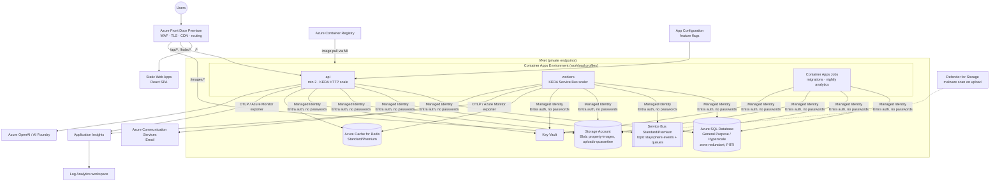

# 12. Azure Production Architecture



| Concern | Production choice | Why |
|---|---|---|
| Compute | **Container Apps** (API + workers), Container Apps Jobs | Same images as local; KEDA scales workers on queue depth; scale to many replicas without managing AKS |
| Frontend | Static Web Apps behind Front Door | Global CDN, cheap, preview environments per PR |
| Identity to Azure | **User-assigned Managed Identity** + Entra auth to SQL, Service Bus, Storage, Key Vault | No connection-string secrets at all |
| User identity | App-owned (ASP.NET Core Identity) | Marketplace users are consumers; Entra ID is used for *staff* (admin/support) SSO as an optional second scheme |
| Secrets | Key Vault references in Container Apps (JWT signing key, provider keys) | Rotatable; JWT signing key ring supports `kid` rollover |
| SignalR scale-out | Redis backplane (or Azure SignalR Service when connections exceed about 10k) | Behind an abstraction; a configuration switch |
| Images | Upload to `uploads-quarantine` → Defender scan → worker validates and creates thumbnails → `property-images` → served via Front Door | Untrusted files never served directly |
| Data protection | SQL TDE, Always Encrypted is not required (no PAN); geo-backup; PITR 14 days | |
| Networking | Private endpoints for SQL, Redis, Service Bus, Storage, Key Vault; Container Apps in a VNet; public ingress only through Front Door (header + Private Link origin) | |

## Environments

| Env | Purpose | Scale | Data |
|---|---|---|---|
| Development | local docker | — | seeded |
| Test | ephemeral per-PR (optional), integration/E2E in CI | minimal SKUs | seeded |
| Staging | prod-like, smoke and perf tests, migration rehearsal | small | anonymised/synthetic |
| Production | live | zone-redundant | real |

Each environment has its own resource group, Bicep parameter file
(`infrastructure/bicep/env/<env>.bicepparam`), Managed Identity and Key Vault. Nothing is shared
across environments.

## Bicep layout
```
infrastructure/bicep/
  main.bicep                 # subscription-scope: RG + modules
  modules/ logAnalytics.bicep appInsights.bicep keyVault.bicep acr.bicep sql.bicep
           redis.bicep serviceBus.bicep storage.bicep containerAppsEnv.bicep
           containerApp.bicep staticWebApp.bicep frontDoor.bicep identity.bicep roleAssignments.bicep
  env/ dev.bicepparam test.bicepparam staging.bicepparam prod.bicepparam
```
Parameters: `environmentName`, `location`, `skuTier` (Basic/Standard/Premium map), `apiImageTag`,
`minReplicas`. `az deployment sub what-if` runs on every infrastructure PR.

## Safe database migrations
1. CI builds `efbundle` and an idempotent SQL script as artifacts.
2. The deploy pipeline runs the **migration Container Apps Job** using an identity that holds the
   `db_ddladmin` role, which the app identity lacks.
3. Migrations are **expand-only** in the same release (new columns nullable or defaulted, no drops).
   Contract steps (drops and renames) ship in a later release once no running version uses
   the old shape.
4. Staging runs the same bundle first. Production requires a manual approval gate.
   PITR is the rollback of last resort, and app rollback is a revision traffic switch.
