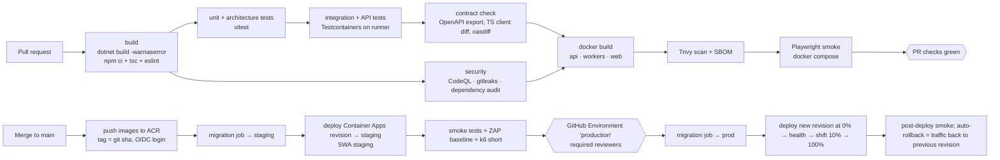

# 17. CI/CD Architecture (GitHub Actions)

| Workflow | Trigger | Notes |
|---|---|---|
| `backend.yml` | PR/push touching `StaySphere/src/**`, `tests/**` | `setup-dotnet` 10.x, NuGet cache, test results + coverage artifacts |
| `frontend.yml` | PR/push touching `StaySphere/web/**` | Node 22, npm cache, Vitest, build |
| `e2e.yml` | PR (smoke), nightly (full) | compose up, Playwright, traces uploaded on failure |
| `infra.yml` | PR touching `infrastructure/bicep/**` | `bicep build`, lint, `what-if` against staging |
| `deploy.yml` | push to `main`, manual | OIDC federated credential to Azure (no stored secrets), environments `staging` → `production` with approval |
| `codeql.yml` | PR + weekly | C# + JS/TS |

- **No long-lived cloud secrets in GitHub**: `azure/login` with OIDC; ACR push through role assignment.
- **Build once, promote**: the same image digest moves staging → production.
- **Migrations** are a separate, gated job ([Azure doc](azure-architecture.md#safe-database-migrations)).
- Concurrency groups prevent overlapping deploys to an environment.
