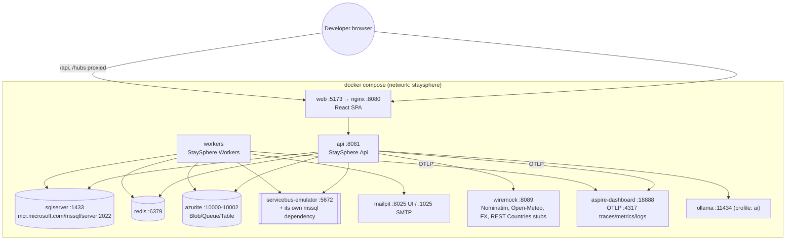

# 11. Local Docker Architecture

The goal is one `docker compose up` that starts everything, with no Azure subscription and no
paid service. See [ADR-006](../adr/ADR-006-local-azure-emulation.md).



| Azure service | Local substitute | Abstraction | Mock/in-memory option |
|---|---|---|---|
| Azure SQL | SQL Server 2022 container | EF Core | Testcontainers in tests |
| Azure Cache for Redis | `redis:7` | `IDistributedCache`, `IConnectionMultiplexer` | `MemoryDistributedCache` |
| Blob Storage | **Azurite** | `IFileStorageService` | `InMemoryFileStorage` (tests) |
| Service Bus | **Official Service Bus emulator** | `IMessageBus` | `InMemoryMessageBus` (`Messaging:Transport=InMemory`) |
| Key Vault | .NET User Secrets / env vars | `IConfiguration` | — |
| Application Insights / Monitor | **Aspire Dashboard** (OTLP) | OpenTelemetry | console exporter |
| Communication Services (email) | **Mailpit** (SMTP) | `IEmailSender` | `LoggingEmailSender` |
| Front Door / CDN | nginx in web container | — | — |
| Azure OpenAI | **Ollama** | `IChatClient` (Microsoft.Extensions.AI) | `ScriptedChatClient` (tests) |
| Payment provider | `LocalFakePaymentProvider` (in-process plus webhook emitter) | `IPaymentProvider` | — |
| External public APIs | WireMock (`EXTERNAL_SERVICES_MODE=Mock`) or the real free APIs (`=Live`) | `IGeocodingService`, `IWeatherService`, `ICurrencyService`, `ICountryService` | `Mock*Service` |

## Profiles
- `docker compose up`: infrastructure + api + workers + web, in mock external mode.
- `docker compose --profile ai up`: adds Ollama. Pull a model once with
  `docker compose exec ollama ollama pull <model>` and set `AI__Model`.
- `docker compose -f docker-compose.yml -f docker-compose.infra-only.yml up`: dependencies
  only, for running the API/web from an IDE with hot reload.

## Developer commands (planned)
```bash
git clone <repo> && cd StaySphere
cp .env.example .env            # dev-only fake secrets; .env is git-ignored
docker compose up -d            # full stack
# or IDE mode:
./scripts/dev-infra.sh          # infra only
dotnet restore && dotnet run --project src/StaySphere.Api   # auto-migrates + seeds in Development only
cd web/staysphere-web && npm ci && npm run dev
```

| URL | What |
|---|---|
| http://localhost:5173 | SPA |
| http://localhost:8081/swagger | API docs |
| http://localhost:8025 | Mailpit inbox |
| http://localhost:18888 | Traces, metrics and logs (Aspire Dashboard) |

All containers run as **non-root** where the image allows it (API and web on
`mcr.microsoft.com/dotnet/aspnet:10.0` with `USER app`, nginx-unprivileged). Multi-stage builds:
SDK restore → build → test → publish → chiseled runtime; Node build → nginx-unprivileged.

> **Resource note:** SQL Server plus the Service Bus emulator (which needs its own SQL instance)
> uses about 4 GB RAM. Set `Messaging__Transport=InMemory` to skip the emulator on small machines.
